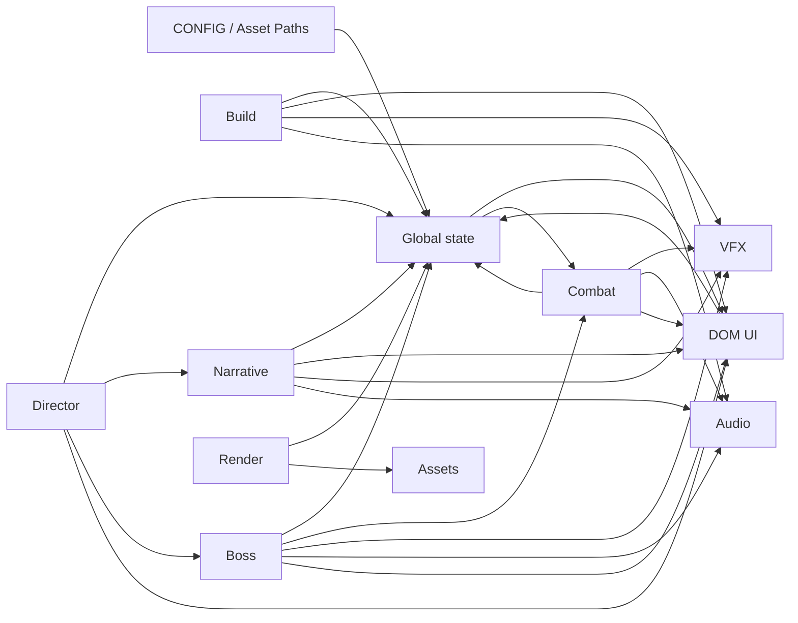

# Logic Foundation Audit

Project: 《大荒轮回录：荒境》  
Scope: Logic Foundation Phase 1  
Date: 2026-08-14  
Rule: Audit only. No runtime code, CSS, asset, config, layout, test, or value changes.

## 0. Audited Files

- `index.html`
- `src/game.js`
- `src/config.js`
- `tools/smoke-test.mjs`
- `tools/visual-run.mjs`
- `tools/validate-ui-metadata.mjs`
- `tools/generate-ui-snapshots.mjs`
- `tools/audit-assets.mjs`
- `package.json`

This document records current behavior from the running code. It does not describe the intended final design unless explicitly marked as future readiness.

## 1. Run Lifecycle

### 1.1 命格选择

- Entry:
  - `renderLineageSelect()` in `src/game.js:1295`
  - Click handler per lineage card in `src/game.js:1327`
- Core state:
  - `selectedLineage`
  - `CONFIG.lineages`
- Transition condition:
  - User clicks a visible lineage card.
  - `playableLineages()` filters `CONFIG.lineages` by `!lineage.hidden`.
- Main systems called:
  - DOM/UI creation through `ui.lineageList`
  - `renderLineageSelect()` re-renders the selection state.
- Current actual behavior:
  - Selection is stored globally in `selectedLineage`.
  - Hidden lineages are excluded from selectable cards.
  - The start screen is DOM-driven, not canvas-driven.

### 1.2 开局

- Entry:
  - `startGame()` in `src/game.js:1367`
  - `ui.startBtn.addEventListener("click", startGame)` in `src/game.js:3796`
- Core state:
  - `state = freshState()`
  - `state.running = true`
  - `state.paused = false`
  - `state.lineage`, `state.map`, `state.chapter`
- Transition condition:
  - User clicks Start button.
  - If selected lineage is hidden, code falls back to first playable lineage.
- Main systems called:
  - `ensureAudio()`, `startMusic()`
  - `freshState()`
  - DOM overlay hiding/showing
  - `syncBuildQuickUi()`
  - `playSound("level")`
- Current actual behavior:
  - Game state is fully recreated at start.
  - UI overlays are directly manipulated from lifecycle code.
  - Audio begins during start.

### 1.3 战斗

- Entry:
  - `loop(now)` in `src/game.js:3726`
  - `update(dt)` in `src/game.js:2269`
- Core state:
  - `state.player`
  - `state.enemies`
  - `state.projectiles`
  - `state.clouds`
  - `state.effects`, `state.pulses`, `state.damageTexts`
  - `state.chapter`
- Transition condition:
  - `state && state.running && !state.paused`
- Main systems called:
  - Movement: `movementVector()`
  - Spawn: `spawnEnemy()`
  - Weapons: `fireSword()`, `fireTalisman()`, `castFlame()`, `castPhantom()`
  - Chapter: `updateChapterDirector()`
  - Narrative: `checkStoryEvents()`
  - Boss: `updateChapterBoss()`
  - Combat feedback: `addEffect()`, `addDamageText()`, `addShake()`, `playSound()`
- Current actual behavior:
  - Combat, movement, spawn, chapter, narrative, VFX, SFX, and hit feedback run from one update loop.
  - Weapon cooldowns and projectile behavior are state mutations inside `update()`.

### 1.4 击杀 / 经验

- Entry:
  - Enemy damage: `applyEnemyDamage()` in `src/game.js:1724`
  - Enemy death resolution in `update()` enemy cleanup loop
  - Pickup resolution in `update()` drop loop
  - `gainXp(amount)` in `src/game.js:2003`
- Core state:
  - `enemy.hp`
  - `state.kills`
  - `state.drops`
  - `state.resources.soul`
  - `state.resources.fire`
  - `state.player.xp`
- Transition condition:
  - Projectile/cloud/flame damages enemy until `enemy.hp <= 0`.
  - Enemy death pushes a drop.
  - Player picks up a drop when within pickup radius.
- Main systems called:
  - `applyEnemyDamage()`
  - `addEffect()`, `addDamageText()`, `addShake()`, `playSound()`
  - `gainXp()`
- Current actual behavior:
  - Death logic directly creates drops and combat feedback.
  - XP and Soul are coupled: `gainXp()` adds both `state.player.xp` and `state.resources.soul`.
  - Elite enemies produce Fire through drop pickup.

### 1.5 升级

- Entry:
  - `gainXp(amount)` in `src/game.js:2003`
- Core state:
  - `state.player.xp`
  - `state.player.nextXp`
  - `state.player.level`
  - `state.weapons.sword`
- Transition condition:
  - `while (state.player.xp >= state.player.nextXp)`
- Main systems called:
  - Level-up pacing from `pacingSection("levelUp")`
  - Direct sword stat mutations
  - VFX/SFX feedback
  - `openChoices()`
- Current actual behavior:
  - Level-up always gives baseline sword improvement before opening choices.
  - Level-up opens the build choice overlay and pauses the game.

### 1.6 Build / Upgrade

- Entry:
  - `openChoices()` in `src/game.js:2069`
  - Choice button click handler in `src/game.js:2084`
  - `skipChoices()` in `src/game.js:2119`
  - Build panel: `openBuildPanel()` / `renderBuildLedger()`
- Core state:
  - `CONFIG.upgrades`
  - `state.weapons`
  - `state.player`
  - `state.passive`
  - `state.mechanics`
  - `state.build`
  - `state.resources.soul`
- Transition condition:
  - Level-up opens three random choices.
  - User chooses one option or skips.
- Main systems called:
  - `applyEffect(state, effect)`
  - `recordBuild(option)`
  - DOM choice card rendering
  - Feedback: effects, alert, damage text, shake, sound
- Current actual behavior:
  - Build is effect-array driven, but effects directly mutate arbitrary state paths.
  - Build ledger records selected cards after mutation.
  - Current build UI is DOM-driven.

### 1.7 Chapter / Event

- Entry:
  - `updateChapterDirector()` in `src/game.js:1796`
  - `chapterEventPoint()` in `src/game.js:1560`
  - `checkStoryEvents()` in `src/game.js:2255`
  - `openStoryEvent(event)` in `src/game.js:2201`
- Core state:
  - `state.chapter`
  - `state.map.events`
  - `state.storySeen`
  - `state.pendingStory`
  - `state.chapter.memories`
- Transition condition:
  - Timeline thresholds from `CHAPTER_ONE_TIMELINE`.
  - Player enters event trigger radius.
- Main systems called:
  - Chapter notices
  - Story overlay DOM
  - Story rewards directly mutating player/weapons/resources/chapter
  - VFX/SFX feedback
- Current actual behavior:
  - First and second story events are time-spawned.
  - Event interaction is proximity-triggered, not button-confirmed.
  - Story event both displays narrative and applies gameplay rewards.

### 1.8 Boss

- Entry:
  - Boss warning/spawn via `updateChapterDirector()` in `src/game.js:1796`
  - `spawnChapterBoss()` in `src/game.js:1599`
  - `updateChapterBoss(enemy, dt)` in `src/game.js:1740`
- Core state:
  - `state.chapter.bossSpawned`
  - `state.chapter.bossId`
  - `state.chapter.bossName`
  - `state.chapter.bossPhaseSeen`
  - Boss enemy object inside `state.enemies`
- Transition condition:
  - `state.time >= CHAPTER_ONE_TIMELINE.bossSpawn`
  - Boss HP crosses configured phase thresholds.
  - Boss HP reaches zero.
- Main systems called:
  - `spawnEnemyAt()`
  - `spawnBossMinions()`
  - `bossGroundRupture()`
  - `bossShockwave()`
  - `syncChapterReadabilityUi()`
  - `completeChapter()`
- Current actual behavior:
  - Boss is an enemy with extra fields, not a separate boss system.
  - Boss phases are driven by HP thresholds and directly trigger VFX/SFX/spawns/notices.
  - Boss death immediately completes chapter and ends the run.

### 1.9 Result

- Entry:
  - `endGame(reason)` in `src/game.js:1391`
  - Death, timeout, or `completeChapter()`
- Core state:
  - `state.running = false`
  - `state.paused = true`
  - `state.kills`
  - `state.time`
  - `state.chapter.memories`
  - `state.build`
  - `state.resources`
- Transition condition:
  - Player HP <= 0.
  - Chapter time limit reached.
  - Chapter Boss defeated.
- Main systems called:
  - Result DOM
  - Build summary DOM
  - Audio feedback
- Current actual behavior:
  - Result uses current run state and displays a summary.
  - Meta points are calculated from kills and time inside result code.

## 2. game.js Responsibility Audit

| Responsibility | Current evidence | Classification |
| --- | --- | --- |
| Game State | Global `state`, `freshState()`, many direct mutations | EXTRACT |
| Run Lifecycle | `startGame()`, `endGame()`, restart handlers | EXTRACT |
| Player | Movement, dash, HP, XP, level, animation in `game.js` | EXTRACT |
| Combat | Enemy contact, projectile collision, damage, death in `update()` | EXTRACT |
| Enemy | Spawn, movement, health, elite/Boss flags | EXTRACT |
| Projectile | Creation, homing, collision, lifetime | EXTRACT |
| Damage | `applyEnemyDamage()`, player damage, floating text | DECOUPLE |
| Spawn | `spawnEnemy()`, `spawnEnemyAt()`, chapter elite/Boss spawns | EXTRACT |
| Chapter Director | Timeline, objectives, story/Boss triggers | EXTRACT |
| Boss | Boss enemy extension, phases, skills, UI sync | EXTRACT |
| Build/Upgrade | Choices, effect application, ledger, build hints | EXTRACT |
| Narrative | Story data resolution, overlay, story rewards | EXTRACT |
| Canvas Rendering | Background, map, actors, VFX, projectiles, text | DECOUPLE |
| VFX | `effects`, `pulses`, `addEffect()`, direct calls in logic | DECOUPLE |
| Audio | WebAudio creation/playback and direct gameplay calls | DECOUPLE |
| DOM/UI interaction | UI refs, overlay creation, button listeners, sync | EXTRACT |
| Asset Runtime | `ASSET_PATHS`, `assets`, draw helpers | EXTRACT |
| Mobile Input | Touch stick, dash, resize | DEFER |
| Smoke-test hooks/global access | Relies on globals from non-module script | DEFER |

Notes:

- `KEEP` is not used for major systems because the current file is the integration point for almost all systems.
- `DEFER` means it can stay in place until the first Vertical Slice needs deeper work.
- `EXTRACT` does not mean immediate large refactor. It means this responsibility should have a boundary before it grows further.

## 3. State Ownership

### Player State

- Created by:
  - `freshState()` from `CONFIG.weapons`, selected lineage base stats, selected lineage weapon/passive overrides.
- Modified by:
  - Movement and dash in `update()` / `dashPlayer()`.
  - XP and level in `gainXp()`.
  - Enemy contact and Boss damage through `update()` / `damagePlayerAt()`.
  - Build effects through `applyEffect()`.
  - Narrative rewards through `openStoryEvent()`.
- Consumed by:
  - Combat targeting, collision, camera, rendering, HUD, chapter director, story triggers, build display.
- Ownership issue:
  - Multiple owners: combat, build, narrative, lifecycle, UI sync, and input all directly read/write player state.
  - Risk: HIGH.

### Run State

- Created by:
  - `freshState()` and initialized by `startGame()`.
- Modified by:
  - `startGame()`, `endGame()`, pause handlers, choice/story/build overlays.
- Consumed by:
  - `loop()`, `update()`, render, UI handlers, smoke-test.
- Ownership issue:
  - UI overlay state and run pause state are strongly coupled.
  - Risk: MEDIUM.

### Combat State

- Created by:
  - `freshState()` arrays: enemies, projectiles, drops, pulses, clouds, effects, damageTexts.
- Modified by:
  - Spawn, weapon functions, projectile collision, enemy death, pickup logic, Boss skills.
- Consumed by:
  - Render, HUD counters, chapter Boss UI, smoke-test.
- Ownership issue:
  - Combat logic owns gameplay consequences and presentation feedback at the same time.
  - Risk: HIGH.

### Enemy State

- Created by:
  - `spawnEnemy()` and `spawnEnemyAt()`.
- Modified by:
  - Movement in `update()`.
  - Damage through `applyEnemyDamage()`.
  - Boss phase logic through `updateChapterBoss()`.
  - Slow/mark mechanics through skill logic.
- Consumed by:
  - Targeting, collision, rendering, Boss UI, chapter completion.
- Ownership issue:
  - Boss is implemented as an enemy with additional ad hoc fields.
  - Risk: MEDIUM.

### Upgrade / Build State

- Created by:
  - `freshState()` creates empty `state.build`.
  - `CONFIG.upgrades` defines option effects.
- Modified by:
  - Choice click handler applies effects and calls `recordBuild()`.
  - `skipChoices()` modifies Soul.
- Consumed by:
  - Build quick UI, build overlay, result summary, selected choice feedback.
- Ownership issue:
  - Build effect application can write arbitrary state paths without a domain boundary.
  - Risk: HIGH.

### Chapter State

- Created by:
  - `freshChapterState()`.
- Modified by:
  - `updateChapterDirector()`, `chapterAlert()`, `openStoryEvent()`, `spawnChapterBoss()`, `updateChapterBoss()`, `completeChapter()`.
- Consumed by:
  - HUD, chapter alert, Boss UI, story rewards, spawn pressure, result.
- Ownership issue:
  - Chapter Director is the logical owner, but narrative, Boss, HUD, and result all directly depend on its internal fields.
  - Risk: HIGH.

### Boss State

- Created by:
  - Boss enemy object in `spawnChapterBoss()`.
- Modified by:
  - `updateChapterBoss()`, `applyEnemyDamage()`, enemy death loop.
- Consumed by:
  - Render, Boss HUD, chapter completion, enemy movement speed.
- Ownership issue:
  - Boss fields live inside enemy objects; Chapter State also duplicates Boss identity and phase fields.
  - Risk: MEDIUM.

### Narrative State

- Created by:
  - `freshState()` creates `storySeen`, `pendingStory`, and chapter memories.
- Modified by:
  - `openStoryEvent()`, `closeStoryEvent()`, `checkStoryEvents()`.
- Consumed by:
  - Map event rendering, story overlay, chapter rewards, result.
- Ownership issue:
  - Narrative state and gameplay rewards are applied in the same function.
  - Risk: HIGH.

### UI State

- Created by:
  - DOM in `index.html`.
  - `const ui = {...}` in `src/game.js`.
- Modified by:
  - Lifecycle, choices, build panel, story overlay, pause, result, runtime sync.
- Consumed by:
  - Gameplay logic checks `classList.contains("hidden")` to decide whether story/build/choices can run.
- Ownership issue:
  - UI state is used as gameplay control state.
  - Risk: HIGH.

## 4. Config / Single Source of Truth Audit

### Truly Config-Driven Today

- Chapter pacing:
  - `CONFIG.chapterOne.timeline`
  - `CONFIG.chapterOne.pacing`
  - `CONFIG.chapterOne.pressure`
- Chapter stories:
  - `CONFIG.chapterOne.stories`
- Boss config:
  - `CONFIG.chapterOne.boss`
- Elite wave config:
  - `CONFIG.chapterOne.eliteWave`
- Lineages:
  - `CONFIG.lineages`
- Weapons:
  - `CONFIG.weapons`
- Upgrade options:
  - `CONFIG.upgrades`
- Enemy stat tables:
  - `CONFIG.enemies`
- Maps and map feature/event generation:
  - `CONFIG.maps`
- Runtime caps:
  - `CONFIG.tuning` plus `CONFIG.chapterOne.pacing.runtimeLimits`

### Still Hardcoded In Runtime Logic

- DOM element IDs and overlay flow.
- `ASSET_VERSION = "0.3.4b1-ui-pass2"`.
- `ASSET_PATHS` runtime asset paths.
- UI strings such as pause labels, choice markup, result phrasing, Boss fallback labels, story fallback table.
- Build tag logic in `buildTagFor()`.
- Level-up baseline sword improvement side effect in `gainXp()`.
- Boss object ad hoc runtime fields in `spawnChapterBoss()`.
- VFX/SFX type strings passed from gameplay logic.
- Canvas render ordering and draw scales/anchors.
- Event visual scales and story marker rendering parameters.

### Duplicate / Multiple Definition Sources

- Runtime tuning exists both in `CONFIG.tuning` and `CONFIG.chapterOne.pacing.runtimeLimits`.
- Chapter fallback config exists in `src/game.js` even when `CONFIG.chapterOne` exists.
- Story text exists in `CONFIG.chapterOne.stories` and fallback story tables in `storyForEvent()`.
- UI dimensions / safe areas exist across:
  - CSS (`styles.css`, `styles-ui.css`, `styles-mobile.css`)
  - Runtime sprite metadata (`assets/runtime/webp/ui/formal_v034b1/ui_runtime_atlas.json`)
  - Story manifest (`assets/runtime/webp/ui/story/manifest-art.json`)
  - Validator targets in `tools/validate-ui-metadata.mjs`
  - DOM structure in `index.html`
- Asset deployment state exists across:
  - `ASSET_PATHS` in `src/game.js`
  - `assets/asset-manifest.v0.3.json`
  - map package manifests
  - `tools/audit-assets.mjs`

### Current Data Quality Notes

- `src/config.js` and `index.html` contain visible mojibake/encoding corruption in many Chinese strings.
- Existing validator marks Lineage Card and Choice Card metadata as TBD.
- Story UI metadata has known size conflict between manifest and current asset in validator targets.

## 5. System Dependency Map

### Actual Dependency Direction

### Marked Couplings

- Gameplay directly operates DOM:
  - `startGame()`, `endGame()`, `openChoices()`, `openStoryEvent()`, `closeStoryEvent()`, `syncRuntimeUi()`, pause/build handlers.
- UI directly modifies Gameplay State:
  - Choice click handler applies effects to `state`.
  - Pause/build/story controls mutate `state.paused`.
  - Start/restart recreate or expose run state.
- VFX/Audio are strongly bound to Gameplay Logic:
  - Combat, pickup, level-up, story, Boss, and chapter code directly call `addEffect()`, `addDamageText()`, `addShake()`, `playSound()`.
- Chapter/Boss directly depend on concrete UI:
  - Chapter alerts and Boss frames are synced by direct DOM functions.
- Build directly writes other systems' internal state:
  - `applyEffect(state, effect)` writes paths like `weapons.sword.count`, `player.maxHp`, `mechanics.pickupBurst`.
- Cycles:
  - `Gameplay State -> UI -> Gameplay State`
  - `Combat -> VFX/Audio -> timing effects -> Combat-visible state` through delayed Boss rupture using `setTimeout()`
  - `Chapter -> Narrative -> Chapter/Player/Weapons -> Chapter pressure/Boss`

## 6. Smoke Test Audit

### Existing Coverage

- `tools/smoke-test.mjs`
  - Loads `src/config.js` and `src/game.js` in a VM.
  - Starts a run.
  - Simulates keyboard movement and chunk generation.
  - Opens upgrade choices.
  - Checks choices are free and contain "领悟".
  - Checks skipping gives +2 Soul and unpauses.
  - Checks touch movement.
  - Checks pause overlay state.
  - Calls `endGame()`.
  - Checks formal UI asset hooks exist for a small subset.
- `tools/visual-run.mjs`
  - Uses Playwright-like browser execution to create visual states and screenshots.
  - Mutates state directly to stage combat, build, pause, story, result, and mobile-ish states.
- `tools/validate-ui-metadata.mjs`
  - Checks selected UI asset dimensions and metadata bounds.
- `tools/generate-ui-snapshots.mjs`
  - Generates UI snapshots and geometry data for HUD, Resource, Lineage, Choice, Story, Boss.
- `tools/audit-assets.mjs`
  - Checks runtime asset references, manifest consistency, forbidden runtime refs, and bucket sizes.

### Not Covered

- Full first chapter clear from start to Boss defeat.
- Boss entrance and Boss phase changes as an automated assertion.
- Story event proximity interaction across both maps.
- Build transformation correctness beyond a shallow choice/skip path.
- Enemy death/drop/pickup/level-up loop as an end-to-end automated assertion.
- Audio presence/trigger policy beyond code existence.
- VFX correctness or visual layering beyond snapshots.
- Mobile start/choice flow as functional assertions.
- No automated check that CSS placeholder UI is absent from runtime UI.
- No automated check that text stays within authoritative safe areas during real gameplay.

### Silent Regression Risks

- UI state being used as gameplay gate can silently block story triggers.
- Build effect paths can silently fail or mutate the wrong state if state shape changes.
- Boss phase timers and delayed `setTimeout()` effects can desync after pause/state replacement.
- Asset path/version mismatch can show stale UI while smoke test still passes.
- Encoding/mojibake can persist unnoticed because tests check mechanics more than readable copy.

## 7. Vertical Slice Readiness

### Build Transformation

- Current support:
  - Partial.
  - Build can mutate arbitrary state paths and some mechanics (`swordMark`, `talismanSplit`, `pickupBurst`, `guard`) already cause behavior changes.
- Directly extensible?
  - Small transformations: yes.
  - Multi-skill evolution and clear build identity: only with risk.
- Minimum necessary modification:
  - Introduce a small build effect dispatcher or event output layer so upgrade choices produce typed gameplay changes instead of raw path writes only.
  - Keep current path effects as compatibility, but add explicit transformation hooks.
- Risk if unchanged:
  - HIGH. Build transformations will scatter into weapon/combat/narrative code and become hard to test.
- Classification:
  - BLOCKER for a meaningful first chapter build identity.

### Combat Juice

- Current support:
  - Partial.
  - Damage already triggers VFX/SFX/floating text/shake.
- Directly extensible?
  - Visually yes, structurally risky.
- Minimum necessary modification:
  - Add a small gameplay event queue or feedback dispatcher for combat events such as hit, crit, kill, elite death, Boss phase, pickup, level-up.
  - Presentation can consume those events while combat remains the source of truth.
- Risk if unchanged:
  - HIGH. More juice will further bind VFX/audio/camera to damage branches.
- Classification:
  - SHOULD FIX before expanding many skills/effects; not an immediate blocker for a small demo.

### Narrative Event

- Current support:
  - Partial.
  - Narrative can trigger by time-spawned map point and proximity.
  - Story rewards can mutate player/weapons/chapter state.
- Directly extensible?
  - Limited. Current flow is mostly fixed Story Panel + immediate rewards.
- Minimum necessary modification:
  - Add a narrative trigger registry with conditions based on time, location, Boss state, build route, kills, chapter state.
  - Keep current `openStoryEvent()` as presentation.
- Risk if unchanged:
  - HIGH. RPG narrative will remain timeline/proximity-only and cannot express planned linear-plus-reincarnation structure cleanly.
- Classification:
  - BLOCKER for first chapter narrative identity.

### Boss Entrance

- Current support:
  - Partial.
  - Boss spawn has alert, VFX, shake, sound, enemy creation.
- Directly extensible?
  - Limited. Multi-stage entrance would be difficult because spawn, alert, audio, VFX, and enemy state are one function.
- Minimum necessary modification:
  - Split Boss entrance into a small sequence table/state machine: warning -> scene cue -> spawn -> nameplate -> active.
  - Do not need a full cinematic system yet.
- Risk if unchanged:
  - MEDIUM/HIGH. Boss can work mechanically but will not feel like a chapter climax.
- Classification:
  - SHOULD FIX before polishing Boss.

### Environment Event

- Current support:
  - Low/partial.
  - Map events and features exist.
  - Scene pack rendering reads map/feature state.
- Directly extensible?
  - Somewhat. Current generated map can add events/features, but environment response to chapter/narrative is not isolated.
- Minimum necessary modification:
  - Allow chapter/narrative to enqueue environment mutations such as add decal set, change spawn pool, reveal event, intensify atmosphere.
- Risk if unchanged:
  - MEDIUM. Chapter can still run, but scene will not carry story progression strongly.
- Classification:
  - SHOULD FIX for stronger differentiation; not a first implementation blocker.

## 8. Risk Classification

### BLOCKER

1. HIGH - Narrative triggers are not yet a condition-driven story system.
   - Blocks first chapter Vertical Slice because the project difference relies on RPG narrative beats and reincarnation memory.
2. HIGH - Build transformation relies on raw state path mutation without typed ownership.
   - Blocks planned meaningful build evolution if first chapter needs skill behavior transformation.
3. HIGH - UI state gates gameplay state.
   - Blocks reliability because hidden/shown overlays can prevent story/build/pause flow without a gameplay-level state machine.
4. HIGH - `game.js` owns lifecycle, combat, build, narrative, Boss, rendering, VFX, audio, and UI.
   - Blocks safe expansion if first chapter adds more scripted beats, Boss behaviors, and build transformations in one pass.
5. HIGH - Config/document/DOM text currently has encoding corruption in important runtime strings.
   - Blocks reliable narrative readability if not corrected before first chapter content lock.

### SHOULD FIX

1. HIGH - Combat feedback is directly hardbound to damage logic.
2. HIGH - Build choice UI directly applies gameplay effects.
3. MEDIUM - Boss is an enemy extension with duplicated chapter Boss state.
4. MEDIUM - Boss entrance lacks a clear sequence state.
5. MEDIUM - Environment events are generated/rendered but not a clean chapter response system.
6. MEDIUM - Multiple config fallback sources can hide stale data.
7. MEDIUM - Result/meta reward calculation is hardcoded in result UI flow.
8. MEDIUM - Tests do not cover chapter clear/Boss phase/story interaction.
9. MEDIUM - Existing UI metadata is incomplete or conflicting for key components.
10. MEDIUM - Delayed Boss rupture uses `setTimeout()` against mutable global state.

### DEFER

1. LOW - Mobile touch stick can remain current until mobile UI phase.
2. LOW - Fine-grained asset loading ownership can wait unless bundle pressure increases.
3. LOW - Current canvas render helper structure can stay if no new render layer is needed.
4. LOW - Smoke-test VM globals can remain while game is non-module.
5. LOW - Advanced audio mixing/music system can wait after baseline event hooks exist.

### Counts

- BLOCKER: 5
- SHOULD FIX: 10
- DEFER: 5

## 9. Final Recommendation: Minimum Foundation Refactor

This is the minimum foundation work needed to support Build + Combat Juice + Narrative + Boss + Environment without turning the prototype into a large-engine rewrite.

### 9.1 Add a Run Phase Field

- Add one authoritative gameplay phase field later, for example:
  - `lineage_select`
  - `running`
  - `choice`
  - `story`
  - `pause`
  - `build`
  - `boss_intro`
  - `result`
- Reason:
  - Current code infers gameplay permission from DOM hidden state.
- Minimum target:
  - UI can reflect phase, but gameplay should not depend on DOM visibility as source of truth.

### 9.2 Add a Small Gameplay Event Queue

- Events only need to cover:
  - `damage.hit`
  - `enemy.kill`
  - `pickup.collect`
  - `level.up`
  - `build.choose`
  - `story.open`
  - `boss.warn`
  - `boss.spawn`
  - `boss.phase`
  - `chapter.clear`
- Reason:
  - Combat Juice should be driven by gameplay events, not embedded in every damage branch.
- Minimum target:
  - Existing VFX/SFX functions can remain; they should consume events through one feedback dispatcher.

### 9.3 Wrap Build Effects

- Keep current `effects: [[path, op, value]]` for simple numeric upgrades.
- Add typed effect hooks for transformations:
  - `unlockMechanic`
  - `modifyWeaponBehavior`
  - `addSynergy`
  - `registerOnHit`
  - `registerOnPickup`
- Reason:
  - Current raw path writes are useful but insufficient for behavior-changing builds.

### 9.4 Add Narrative Trigger Definitions

- Keep current story panel and story data.
- Add trigger conditions:
  - time
  - map/event proximity
  - kills
  - Boss phase/death
  - build route
  - memory count
- Reason:
  - First chapter needs linear narrative beats plus reincarnation fragments.

### 9.5 Add Boss Entrance Sequence State

- Do not build a full cinematic framework.
- Minimum phases:
  - warning
  - scene cue
  - nameplate
  - spawn lock
  - active
- Reason:
  - Boss should support scene change, subtitle, sound, spawn, and activation without one monolithic spawn function.

### 9.6 Add Environment Mutation Hooks

- Minimal actions:
  - add event point
  - reveal decal group
  - change spawn pressure
  - change ambient layer intensity
  - mark scene state for rendering
- Reason:
  - Maps need to react to chapter and story state.

### Not Recommended Yet

- Do not split every file immediately.
- Do not rewrite rendering.
- Do not introduce a framework.
- Do not replace all config systems.
- Do not build a large ECS.

The immediate foundation should be a few clear seams around phase, events, build transformations, narrative triggers, Boss sequence, and environment mutations.

